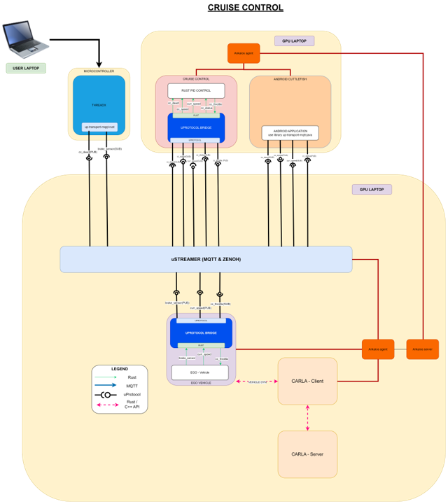

# SDV Lab

Simulate a realistic, modular, and cyber-physical Software-Defined Vehicle (SDV) development environment where teams can design, implement, and demonstrate an SDV feature that
operates across a virtual platform.

The challenge comes with a demo scenario, called the `Cruise Control`, running a cruise control ADAS application in the SDV Lab environment. Be creative and innovative and enhance the existing `Cruise Control` scenario or develop applications in the SDV Lab environment for your custom use case.

## Cruise Control Scenario Architecture



## Prerequisites

- Your notebook
- Notebook with GPU and Ubuntu 22.04 or 24.04 (LTS) from hack coaches

On your notebook you will connect the ThreadX microcontroller for development and input.

The shared notebooks from the hack coaches are equipped with enough computing resources to run Carla simulator and the cruise controll applications.

## Installation

### Your PC

Connect the ThreadX Microcontroller via USB.

**Note:** If you use a WSL2, you need to enable USB support according to the [Microsoft WSL2 USB Docs](https://learn.microsoft.com/de-de/windows/wsl/connect-usb).

### GPU Notebook

This is the notebook shared from the hack coaches.

#### CARLA

Setup the notebook with CARLA or get one from the hack coaches.

Download CARLA from [GitHub Repository](https://github.com/carla-simulator/carla/releases/tag/0.9.15/)

For additional details please check the page [CARLA installation](https://carla.readthedocs.io/en/latest/start_quickstart/#carla-installation)

#### Install the Android Cuttlefish IVI

On the PC where CARLA is running, install the Android Cuttlefish IVI (`aaos_digital_cluster`).

#### Install Podman

As [Eclipse Ankaios](https://eclipse-ankaios.github.io/ankaios/0.6) as embedded software orchestrator is used to manage workloads inside the SDV Lab Challenge, you will need to install [Podman](https://docs.podman.io/en/latest/) as a container engine.

You can install Podman easily with the package manager like in Ubuntu:

```
sudo apt-get update
sudo apt-get -y install podman
```

Otherwise follow the official [Podman installation instructions](https://podman.io/docs/installation#installing-on-linux).

#### Install Eclipse Ankaios

Install [Eclipse Ankaios](https://eclipse-ankaios.github.io/ankaios/0.6) with a single curl according to the [Ankaios installation guide](https://eclipse-ankaios.github.io/ankaios/latest/usage/installation).

Follow the `Setup with script` section and install the version Eclipse Ankaios [v0.6.0](https://github.com/eclipse-ankaios/ankaios/releases/tag/v0.6.0).

**Note:** When using Ubuntu-24.04 disable AppArmor like discribed in the Ankaios installation guide.

The installation script will automatically create a systemd service file for the Ankaios server and an Ankaios agent.

We will use the systemd files as user service to start and stop Eclipse Ankaios, so copy the created systemd service files with the following commands:

```shell
mkdir -p ~/.config/systemd/user/
cp /etc/systemd/system/ank-server.service ~/.config/systemd/user/ank-server.service
cp /etc/systemd/system/ank-agent.service ~/.config/systemd/user/ank-agent.service
```

Open the `~/.config/systemd/user/ank-server.service` and append `--address 0.0.0.0:25551` as CLI argument to the `ank-server` process. This makes the Ankaios Server available on all interfaces of the notebook. The advantage is, that you can install the `ank-cli` also on your notebook and connect to the remote Ankaios cluster applying changes if you change some of the default workloads for the cruise control scenario.

You can just export the remote Ankaios server address via env variable and use the `ank-cli` on your notebook:

```shell
export ANK_SERVER_URL=<ip_of_remote_nic>
```

Then you can execute any Ankaios CLI command on the remote Ankaios cluster:

```shell
ank get workloads
```

## Run

Start the `cruise control` scenario by starting:

- CARLA
- AAOS Digital Cluster (Android Cuttlefish IVI)
- Eclipse Ankaios cluster
- Applying the Ankaios manifest [cruise_control.yaml](./cruise_control.yaml)
- Flashing and starting the ThreadX board on your notebook

### Run CARLA

```
cd path/to/carla/root
./CarlaUE4.sh

```

### Run AAOS Digital Cluster


TODO!
```shell
```

### Build the container images

For the EgoVehicle like described in the [EgoVehicle/README.md](./EgoVehicle/README.md#build-for-deployment) (just one script call!).
Build the PID Controller workload like described in `TODO! link the pid controller README of the Rust version`.

### Run Ankaios

```shell
systemctl --user status ank-server ank-agent
```

### Apply the cruise control manfiest

```shell
ank apply cruise_control.yaml
```

**Note:** If you want to remove all workloads specified in the `cruise_control.yaml` you can simply add `-d` paramter to the `ank apply` like the following:
`ank apply -d cruise_control.yaml`. This might be helpful for incremental development.

#### Additional Ankaios commands

```
ank logs <workload_name> // Retrieve the logs from a workload
ank get state // Retrieve information about the current Ankaios system
ank get workloads // Information about the worloads running in the Ankaios system
```


